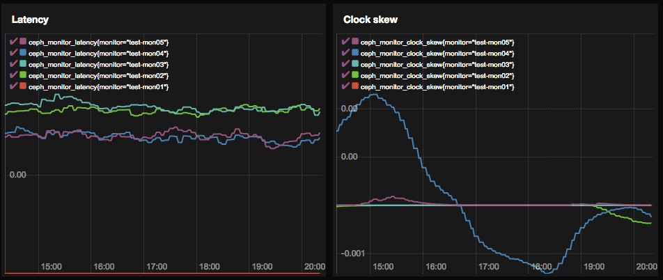

# Ceph Exporter  [](https://godoc.org/github.com/digitalocean/ceph_exporter) [](https://travis-ci.org/digitalocean/ceph_exporter) [](https://coveralls.io/github/digitalocean/ceph_exporter?branch=master) [](https://goreportcard.com/report/digitalocean/ceph_exporter)
Prometheus exporter that scrapes meta information about a running ceph cluster. All the information gathered from the cluster is done by interacting with the monitors using an appropriate wrapper over `rados_mon_command()`. Hence, no additional setup is necessary other than having a working ceph cluster.

## Dependencies

You should ideally run this exporter from the client that can talk to
Ceph. Like any other ceph client it needs the following files to run
correctly.

 * `ceph.conf` containing your ceph configuration.
 * `ceph.<user>.keyring` in order to authenticate to your cluster.

Ceph exporter will automatically pick those up if they are present in
any of the [default
locations](http://docs.ceph.com/docs/master/rados/configuration/ceph-conf/#the-configuration-file). Otherwise you will need to provide the configuration manually using `--ceph.config` flag.

We use Ceph's [official Golang client](https://github.com/ceph/go-ceph) to run commands on the cluster.

Ceph exporter is tested only on Ceph's Hammer(v0.94) and Jewel(v10.2) releases. It might not work as expected with older or non-LTS versions of Ceph.

## Flags

Name | Description | Default
---- | ---- | ----
telemetry.addr | Host:Port pair to run exporter on | `*:9128`
telemetry.path | URL Path for surfacing metrics to prometheus | `/metrics`
ceph.config | Path to ceph configuration file | ""
ceph.user | Ceph user to connect to cluster | `admin`
exporter.config | Path to ceph_exporter configuration file | `/etc/ceph/exporter.yml`
rgw.mode | Enable collection of stats from RGW (0:disabled 1:enabled 2:background) | `0`

## Installation

Typical way of installing in Go should work.

```
mkdir ~/go/src/github.com/cyancow
cd ~/go/src/github.com/cyancow
git clone https://github.com/cyancow/ceph_exporter
go mod init 
go mod vendor 或者 go get
go build
```

A Makefile is provided in case you find a need for it.

## Docker Image

### Docker Hub

The official docker image is available at [digitalocean/ceph_exporter](https://hub.docker.com/r/digitalocean/ceph_exporter/).

### Build From Source

It is also possible to build your own locally from the source. The port `9128` is
exposed as a default port for ceph exporter.

The exporter needs your ceph configuration in order to establish communication with the monitors. You can either pass it in as an additional command or mount the directory containing both your `ceph.conf` and your user's keyring under the default `/etc/ceph` location that `Ceph` checks for.

A sample build command would look like:

```bash
$ docker build -t digitalocean/ceph_exporter .
```

A `--build-args TEST=true` flag can be added to the build command above
to also run `go test` during build:
`docker build -t digitalocean/ceph_exporter . --build-arg TEST=true --no-cache`

You can start running your ceph exporter container now.

```bash
$ docker run -v /etc/ceph:/etc/ceph -p=9128:9128 -it digitalocean/ceph_exporter
```

You would have to ensure your image can talk over to the monitors. If
it needs access to your host's network stack you might need to add
`--net=host` to the above command. It makes the port mapping redundant
so the `-p` flag can be removed.

Point your prometheus to scrape from `:9128` on your host now (or your port
of choice if you decide to change it).

## Contributing

Please refer to the [CONTRIBUTING](CONTRIBUTING.md) guide for more
information on how to submit your changes to this repository.

## Sample view

See ./examples for docker-compose file with Grafana if you'd like to quickly get a test environment up and running.

Link to official documentation explaining docker-compose: https://docs.docker.com/compose/

Docker-compose file itself has comments on how to change it to adapt to your environment. It does use volumes in order to persist data.
Docker volumes documentation: https://docs.docker.com/engine/tutorials/dockervolumes/

If you have [promdash](https://github.com/prometheus/promdash) set up you
can generate views like:



---

Copyright @ 2016-2018 DigitalOcean™ Inc.
